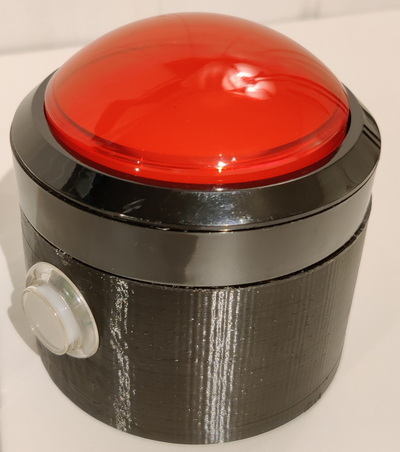

# Game Show / Alarm Button

This code is for a large red button I made to play mp3 sound effects when a button is pressed.



## Design
The main button is a 100 mm massive arcade button.
The secondary button is a 24 mm arcade button.

## Operation
Press main button to play currently selected mp3.
Press secondary button to select next mp3.

# Configuration
## Board and components
I used Wemos D1 mini (ESP8266).

MAX98357A DAC is used for mp3 playback, with a 3W 4ohm 50mm speaker.

Powered by Li-ion battery with TP4056 charger module and MT3608 boost module.

## Filesystem
MP3s are stored in the onboard 4MB flash filesystem (LittleFS).

Edit the setup code to match the actual number of mp3s on the filesystem.
```c++
const int numMp3 = 13;
```

## EEPROM
The selected mp3 nr. is saved in EEPROM and loaded on boot.

## Sleep
The code uses light sleep and never activates wifi.
The device wakes on any button press.

## Circuit
Check "Schematic.pdf" for my circuit. 

## Pins
| WemosD1  |   Function     |
|----------|-----------     |
| RX       |   I2S DATA     |
| D4       |   I2S LRCK     |
| D8       |   I2S BCLK     |
| D1       |   Button action	Input pull-up |
| D2       |   Button konfig	Input pull-up |
| D5       |   Wakeup		    Input pull-up |
| D6       |   Transistor LED	Output 10k pull-down |

## Uploading
I used platformio in Visual Studio Code to upload the code and LittleFS filesystem.

## Sounds
I used 13 mp3 files for sound effects:
1.	Ho,ho,ho
2.	Siren 1
3.	Eventually
4.	Applause
5.	Martian gun
6.	Alarm buzzer
7.	Bike horn
8.	Air horn
9.	Door bell
10.	Fog horn
11.	Siren 2
12.	Police siren
13.	Buzzer wrong

# 3D Print
I printed a case under the button to store the electronics.
Stl-files and Fusion 360 file is included.

# Credits
[ESP8266Audio](https://github.com/earlephilhower/ESP8266Audio)